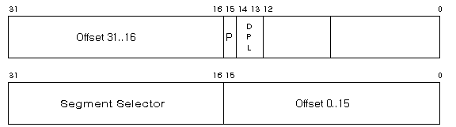
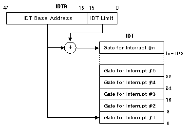
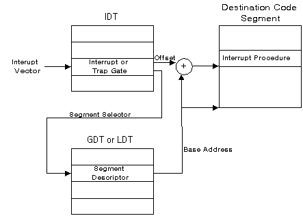

# ANSWER SHEET

Shieeeeeet, if my memory serves me right. Here are some answers.


<br><br>

## 01. MOST SIGNIFICANT BIT

Let's look at this byte. `0 0 0 0 0 0 1 0`, it might look like the value of this byte is obviously 2. <br>
_But is it?_

Well, to calculate the value of this byte is simply to take each lit bit and calculate it's power of two using it's index. But how do we know what the index of the bit is? What do we use as a reference?

Intro, the **most significant bit**.

The most significant bit is the bit in a binary number that holds the largest value, meaning the biggest power of two. This bit is usually the left-most, or the first transmitted. We will get to how do we know that in the future. MSB is the reference that we use to know what side to start our bit indexing from.

Let's get back to that supposedly 2 binary number from before. `0000 0010` if the MSB is the left-most bit, that would represent the largest number 2^7 (128). The right-most bit would represent 2^0 (1) then the bit that is right side to that one will represent 2. However if the right-most bit is the MSB, then the one right side to that will represent one power lower, so that binary number can be interperted as 2^6 which is 64 as well.

It's all depending on the MSB placement.

## 02. BIG ENDIAN VS LITTLE ENDIAN

This relates to the prior answer, systems need to know where the MSB and LSB (least significant bit) are located in their binary structures. To answer that we have endianness.

> A **Big-Endian** system will place it's MSB at the beginning of a binary structure, at the smallest address and the LSB at the end of the structure. it will also transmit and recieve the MSB first.

> A **Little-Endian** is the opposite, it will store it's LSB at the lowest address and the MSB at the end, as well as sending and recieving the LSB first.

So, for example with the binary number from before.

```
BIG ENDIAN        |        LITTLE ENDIAN
                  |
MSB               0                  LSB
                  0
                  0
                  0

                  0
                  0
                  1
LSB               0                  MSB
                  |
Value:            |
2                 |                   64
```

A **little endian** system will keep the number 2 in memory like this: `0100 0000`

<br><br>

##


```diff
- Repeating the question isn't answering it, but i'll let it slide.
+ Repeating what?
+ Did you know that olives cause memory issues?
```
<br><br>

## 04. WHAT IS PROTEC MODE AND WHAT IS REAL MODE

The difference between them is with the complexity of the access to the memory of an application and with how application memories are addressed.<br>
In the CPU there are registers which are tiny buffers that keep memory to be used for operations of the CPU, there is a cluster of registers called the segment registers, they are responsible to keep addresses of data to be used by the CPU.

For example the `Code Segment` register keeps the address of the beginning of the area in memory where the code of the current application is kept. The `Instruction Pointer` register is used to offset the `CS` register and this combination points to the next code instruction in memory that the CPU must execute. That was an explanation on how the cpu calculates the data addresses of the code of the application.

**Real mode** is the cpu mode of operation in which the CPU uses real physical address. In real mode, the `Code Segment` register will point to a segment of memory in the _real memory_ that belongs to the context of the current program. Then, the `Instruction Pointer` register will offset it to the current intruction and that's how a CPU will execute the application in real mode.

> Real Memory used to be the first 1M bytes in memory, today it just refers to the installed RAM installed in the motherboard.

However, that is unsafe since that can lead to overwriting memory written in that _real memory_. To counter that, **protected mode** was introduced with intel's 286 microprocessor.<br>
In it, instead of accessing the _real memory_ directly, the `CS` will point to a segment descriptor. It is a data structure that describes the start, length and access rights of a segment. The segment descriptors are kept in two large tables, called the `Global Descriptor Table` and `Local Descriptor Table`. Global contains the segment descriptor of all applications in it, while the local keeps only the current application's segment descriptors in it.

Afterwards with the introduction of the 386 microprocessor things changed again. **Paging** was added, using paging and a slew of other registers invisible to programs, programs were able to run in their own "confined" memory space. The program's memory is kept in structures called "_pages_" that are fixed in size and spread out in the _real memory_, then those pages are all mapped to one memory space that belongs to the program, no program can access other program's pages. This grants programs their "own" "seperated" memory space which they are free to operate in using their own virtual address ranges that are translated to the _real memory addresses_ where the data resides.


  
**Privilege Rings** is another feature of protected mode where _operating system processes_ and _user processes_ are categorized into 4 privilege level ring from 0 - 3. 0 is the most priveleged level where are process can run, thus OS and driver processes run in those rings and 3 is where user processes will run. These rings exist in order to deny high privilege ring processes from accessing data, call gates or executing instructions which may jeopardize the integrity of the system.

In **real mode** the programs have access to _real memory_ addresses.<br>
In **protected mode** the programs have virtual addresses which are translate using pages, page tables and page directories.

```diff
+ Very thorough answer, great job! 
```
<br>

## 05. REGISTERS

Registers are memory caches inside the CPU that it uses to perform it's calculations and some more operations. Registers can be accessed in 64, 32, 16 and 8 bit modes where each mode of access is given a designated letter: R (Register, 64 bit), E (Extended, 32 bit) and more. There are many types of registers:

#### **General Purpose Registers (GPR)**

> These are registers used for general purposes, here are some of them:
> * **AX** - Accumulator register. Used in arithmatic operations.
> * **CX** - Counter register. Used in shift instructions and counting iterations when doing loops.
> * **DX** - Used in arithmetic operations, like store remainder when doing division.

#### **Segment Registers**

> There are 6 of these:
> * **SS** - Stack Segment, pointer to the stack.
> * **CS** - Code Segment, pointer to the code.
> * etc..

#### **EFLAGS**

> This is a 32 bit register where each bit is a different flag used for and by operations, here are some examples of flags:
> * **ZF** - Zero Flag, is set if the result of an operation is zero. Used in if statements.
> * **SF** - Sign Flag, set if the result of an operation is negative.
> * **OF** - Overflow Flag, Set if the operation results in a number that is too large to contain.

#### Stupid Registers

> These are just some stupid regiters that have nothing in their brains, they are so stupid:
> 
> 

My favorite is the staring hamster, all he does is stare. There are **zero** thoughts going through his head right now. He is simply living the moment.


```diff
+ Positively magnificent. 
```
<br><br>

## 06. IDO ZAIT VS. AMY FLIEGELMAN OLLI

Ido Zait (former team member, 2020 - 2021) wanted to perform a `פולסא דנורא` targeting Amy (Executive Vice President and General Counsel of VMware). A holy ritual meant to shorten one's lifespan and mark him to death in the eyes of god.

To this day the ritual has not shown it's affects but it is not entirely known that the ritual did not have one.

```diff
+ You did your research, props.
```
<br><br>

## 07. TRANSLATING VIRTUAL ADDRESSES TO PHYSICAL ADDRESSES

Let's start off by establishing a few things, the page size that many operating systems like to use is _4KB_ (2 ^ 12 = 4096). That \*bit\* will be useful later, baddom tsssss.

Virtual addresses are logical addresses used by proccesses running in protected mode. They do not point directly at a location in physical memory but there is a simple way to translate them. The secret is in the virtual address itself, the address is made up of different segments that help translate the address.

Modern operating systems use the PML4 scheme for translating addresses so I will explain that one, on a 64 bit computer, meaning 64 bit addresses (indexing bits from 0 to 63).


The 12 last bits of the virtual address are used to offset from the base address of the page where the data is stored. Using 12 bits we can address 4096 different bytes, which matches the page sizes. We are then able to address the pages themselves using the 52 other bits, which gives up the possibility to address 4,503,599,627,370,496 different bytes (4 petabytes). But we wont be needing all of that, so we will dismiss the first 16 bits of that and reserve them for future use. Using 36 bits we are then able to address 68,719,476,736 different bytes (68 Terabytes).

Then, the process starts, there is a register in the CPU called the CR3 which keeps the address of the base of the PML4 (Page Mapping Level 4) entry stack base.<br>
We will use the first 9 (after the unused 16) bits as offset from the base to fine the base address of the correct PML4 entry.

A PML4 entry contains the base address of the PDPT (Page Directory Pointer) Entry stack base.<br>
We will use the next 9 bits to offset from the base of the PML4 entry to find the base address of the correct PDPT entry.

A PDPT entry contains the base address of the Page Directory Entry stack base.<br>
We will use the next 9 bits to offset from the base of the PDPT entry to find the base address of the correct Directory entry.

A Page Directory Entry contains the Page Table Entry stack base.<br>
We will use the next 9 bits to offset from the base of the Directory entry to find the base address of the correct page.

And finally, a Page Table contains the base address of the page in memory.
We will use the 12 remaining bits to offset from the base of the page address to fine the matching Physical address.

<br><br>

## 09. INTERRUPT DESCRIPTOR TABLE

The Interrupt Descriptor Table (IDT) is a table where the Interrupt Service Routines (ISR) are located, entries used as pointers to funtions that should be executed once the CPU reaches an interrupt. IDT entries are called gates, other than Interrupt gates it can contain Task gates and Trap gates.

### **TABLE**
The base address of the IDT and the amount of entries are stored in the Interrupt Descriptor Table Register (IDTR). Entries in the table are _8 bytes_ long in x32 architectures and _16 bytes_ long in x64. Each entry has a few fields that are important to note:

**Offset**
> A 32/64 bit value that represents the address of the entry point of the ISR.

**Gate Type**
> A 4 bit field that contains the type of the gate described in the entry. There are 3 types of gates: Interrupt, Task and Trap.

**DPL - Descriptor Privilege Level**
> A 2 bit value defining the CPU privilege Level required to access this interrupt entry via the INT CPU intruction.

**Segment Selector**
> An pointer to the entry in the GDT/LDT (Global/Local Descriptor Table).



### **GATE TYPES**
There are 3 types of gates:

**Trap Gate**
> This gate is used to handle interruptions that occur when there is bad code.

**Interrupt Gate**
> This gate is used to handle any other kind of interruption.

**Task Gate**
> A x32 architechture specific gate, used for hardware task switching. Since it is slow and not optimized for modern gear it is not really used anymore and even dropped for the x64 arcitechture.

<br><br>
```diff
- You have good knowledge of how the IDT is built and you understand it's parts, but I still don't get what exactly happens when an interrupt happens. Give me a flow chart/event explanation.
+ Alright.
```
<br>

Let's get into the nitty gritty. When the CPU makes an INT call, it will be accompanied with a number, that number will be used as an offset from the IDTR to select the right gate for the interruption.



Then, the entry will be found, privileges will be checked and the procedure's address will be found by:
- offsetting the Segment Selector from the base of the GDT/LDT and getting the pointer to the base address of the segment containing the procedure.
- offsetting the segment base using the offset field inside the IDT Entry to find the address of the procedure's code.<br>
After this the CPU will simply run the procedure.



## 10. PAGE FILE

The pagefile is a file in the hard drive used to store pages that are not current in use by the operating system. The CPU switches pages in and out of memory and stores them in the pagefile by need. The page file in the Windows OS is stored in the path `C:\pagefile.sys`.

The pagefile allows an operating system to store more pages than the DRAM memory allows and keep only the relevant pages in memory while the others are in the disk (or Flash memory). The page file is allowed a size of up to 4 times the amount of phsyical memory you computer has and down to 1.5 times the amount of memory.

Page file are useful in a few cases.

1. Applications running on the system are memory heavy
> The OS can then store idle pages in the pagefile and free up space for other applications.

2. Sudden memory usage spike
> Same as the last one, the system wont crash because it can simply free up some more space.

3. System crash dump
> The pagefile can be used as a crash dump backup.

<br><br>

## 11. MEMORY STRUCTURE: STACK

The stack is a data structure in memory used to store information for later use by the processor, a memory buffer that serves as a LIFO (Last-In-First-Out) buffer. The stack is used to store local variables of procedures & functions. Stacks give us the option to manage memory efficiently. Stacks begin in an address that is fairly high in physical memory and scale down with each variable that is pushed into them.

```diff
- No such thing as "FILO". Google it. It's not what you think.  
+ LIFO :)
```
When a function is entered (including the `Main()` function) a new stack frame is created and each variable declared in that function will get _pushed_ into the stack.<br>
Example..

```C
int main()
{
    int a = 5;
    int b = 6;
    
    int sum = add(a, b);
    return 0;
}

int add(i1, i2)
{
    int c = i1 + i2;
    return c;
}
```
```diff
- This isn't really a "memory" issue, but your code is incorrect. The "add" function doesn't have access to "a" and "b".
+ Corrected :)
```
We enter the `main()` function, so we will create a stack frame for it and push the variable `a`. (columns with an asterisk are for expalnation sake and not really kept in the stack, only the address and value are truly saved)

| frame info*    	| address 	| name* 	| value     |
|---------------	|---------	|-------	|-------    |
| Main locals    	| 1000    	| a     	| 5         |
| .              	|         	|       	|           |
| .              	|         	|       	|           |
| .              	|         	|       	|           |
| .              	|         	|       	|           |
| .              	|         	|       	|           |
| .              	|         	|       	|           |

Then we push the variable `b` and enter the function `add(a, b)` in the 4th line.
When entering another function we create a new frame, first we push the pointer to the frame of the calling function.<br>
Then we allocate the needed space for the variables of this function.<br>
Lastly the locals of this function are being pushed, those are passed from the calling function using registers.

| frame info*        	| address 	| name*          	| value      	|
|--------------------	|---------	|----------------	|------------	|
| Main locals        	| 1000    	| a              	| 5          	|
|                    	| 996     	| b              	| 6          	|
| Add Return address 	| 988     	| Return Address 	| 0x00001000 	|
| Add Parameters     	| 984     	| i1             	| 5          	|
|                    	| 980     	| i2             	| 6          	|
| Add Locals         	| 976     	| c              	| 11         	|
| .                   |         	|                	|            	|

```diff
- How does the code know to give i1 the value of a?
+ Registers.
```
After we are done with the function and we deallocate it's memory and return the value of `c` to `main()`. Then we push `sum`.

| frame info*        	| address 	| name* 	| value 	|
|--------------------	|---------	|-------	|-------	|
| Main locals        	| 1000    	| a     	| 5     	|
| .                   | 996     	| b     	| 6     	|
| .                   | 992     	| sum    	| 11    	|
| .                   |         	|       	|       	|
| .                   |         	|       	|       	|
| .                   |         	|       	|       	|
| .                   |         	|       	|       	|

<br>

As seen in the example, when variables are declared they are automatically pushed into the stack and automatically popped out to be used or when the function exits. This makes it perfect for temporary data, like variables, arguments, parameters and such.<br><br>
There are a few pointers that the system uses to keep track of the stack:

**Stack Pointer**
> Points to the current top of the stack, value in the stack can be refrenced by offsetting this value. This value is kept in a register called the **[ESP] Stack Register** and updated each time a value is pushed and popped into or from the stack.

**Frame Pointer**
> A copy of the Stack pointer right after a new frame is created, after the parmeters and return address are pushed. By virtue, this keeps the base address of the current frame or call stack. This value is saved in the **[EBP] Stack Base Register**.

<br><br>

##


<br><br>

## MEMORY STRUCTURE: HEAP

The heap is a structure in memory used for _dynamic memory allocation_, due to this fact it is slower than using the stack. Heap memory is a more permanent solution for programmers to store data in, memory from the heap can only be allocated by the programmer and will not be deallocated until explicitly freed. This is in **contrast** to Stack memory, where entries are automaticly pushed and popped. This can bring to the case of **memory leak**, when an application has not deallocated the heap memory and lost all pointers to it. This chunk of allocated memory will then be allocated until the program is terminated. This is no biggie for small programs, but large programs which run for days can slow down from memory leakage and even run out of memory and crash. Though this memory is not allocated forever, at program termination the operating system deallocates all the non-deallocated information using garbage collection.

The heap has advantages:
* **Lifetime** - Memory is not automatically deallocated. Programmers have control over the allocation and deallocation of memory.
* **Size** - The programmer can control the amount of memory they want to allocate.

And disatvantages:
* **Management** - Heap memory needs to be managed, to make sure no memory leaks occure.
* **Leaks** - Poor management leads to leaks, which can lead to program crashes.

#### Allocation & Deallocation

As we discussed, memory is allocated manually by the developer. In Java and C++ it will be with the keyword `new`, in C `malloc, calloc and realloc`. The allocation itself happens when the program sends a request for a chunk of memory from the heap memory. The memory is then returned in the form of a pointer to the address of the memory in the heap, the block of memory will be contiguous. 

The heap is a segment in memory bound by a `brk` pointer which tells it where the segment ends and it's base is depicted by the OS and can be extracted at runtime. The OS has no real understanding of the heap memory and thus there is no register to store the addresses of heap memory. The `brk` pointer can be changed using functions like `brk` and `sbrk`.

Memory is deallocated from the heap using the `free` and `zeromemory` functions. Applications should not write to the heap memory using pointers to memory that were already freed since doing that will cause undifined behavior.

#### Problems with Allocation

**Fragmentation**

Heap memory is allocated contiguous and whole which begs the question what to do when there is enough overall free heap memory but not enough contiguous free heap memory? This issue is called fragmentation. There are two types of memory fragmantation.
1. External fragmantation  <br>
Which is what we talked about
<br>
2. Internal Fragmantation  <br>
This happens when excess memory is allocated, meaning a chunk of memory is allocated but it is not entirely used. This will cause a waste of heap memory.

```diff
- You seem to be missing a question here. 
```
